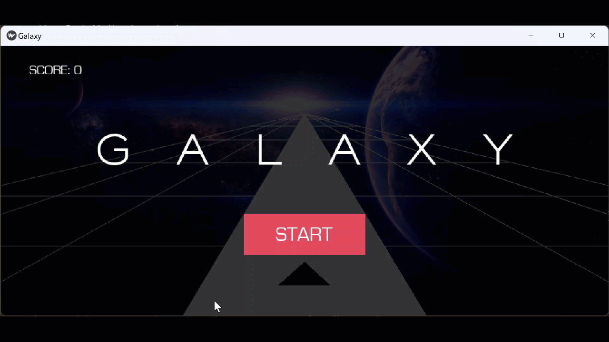

# Space Galaxy Game With Kivy.

 The GALAXY project is a perspective game where you need to keep your spaceship on the track.



## Usage


Install the dependencies

```bash
pipenv install -r requirements.txt 
```

Run server

```bash
python main.py
```